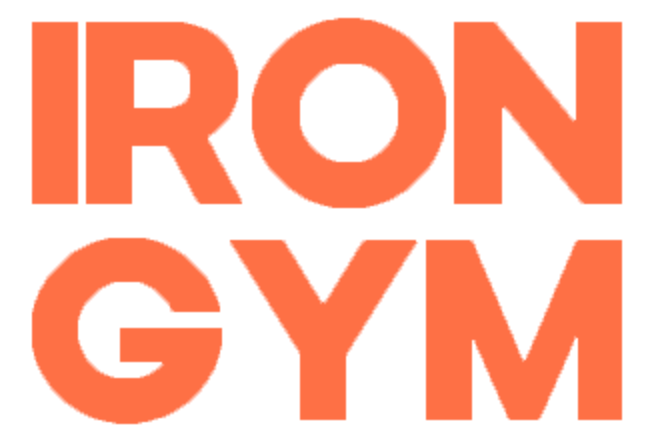

    

## About the Project

A **Iron Gym** description.

🌐 **Live Demo:** [Here](https://gym-flax.vercel.app/)

## Built With

- 
- 
- 

## Screenshot of the Project landing page 📸

## Getting Started

1. Clone the repository.
2. Install the necessary dependencies.
3. Run the project locally.
4. Start exploring the Iron Gym website.

## License

This project is licensed under the [MIT License](https://opensource.org/licenses/MIT).

## Author

Created by **Aldas Kasputis**
- 💻 [GitHub](https://github.com/aldask)
- 👨‍💼 [LinkedIn](https://www.linkedin.com/in/aldas-k-2ab99b1b4)
