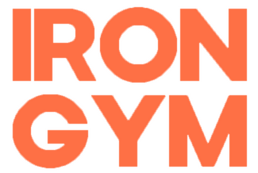

<div align="center">
    
</div>

## About the Project 🏋️‍♂️

Welcome to the Iron Gym Inclusive Fitness Experience repository, where fitness innovation meets inclusivity. This project showcases a forward-thinking approach to fitness technology, emphasizing interactive features and responsive design principles that cater to the diverse needs of every user.

## Project Highlights 🌟

- **Universal Design:** Immerse yourself in an inclusive fitness journey that takes into account the diverse abilities of all users. Explore how our design seamlessly adapts to different needs, creating an empowering experience for everyone.

- **Smooth Animations:** Experience the beauty of seamless animations that guide your interaction with the fitness platform. Discover how animations enhance the visual appeal and user engagement of the platform.

- **Responsive Accessibility:** Witness the adaptability of our design across various devices, highlighting our commitment to accessibility. The Iron Gym portfolio ensures a consistent and enjoyable experience for users, regardless of their chosen device.

- **Gym and Subscription Comparisons:** Discover the curated gym and subscription comparison feature, simplifying the process of finding the perfect fitness center and subscription plan. This feature promotes an inclusive fitness environment that accommodates everyone.

- **Expert Coaches Selections:** Engage with profiles of expert coaches and experience the seamless process of selecting a fitness mentor. See how this interactive element enhances the personalization of the fitness journey for each user.

- **Group Training Schedule:** Keep track of up to one month's worth of scheduled group training sessions at our partner gyms. Plan your workouts and join fellow fitness enthusiasts in dynamic and supportive group settings.

- **Integrated Communication:** Connect with coaches, staff, and fellow fitness enthusiasts through the seamless communication interface. Experience real-time interactions that foster a sense of community and provide support for users from all walks of life.

## Content Customization Made Easy ✏️

One of the standout features of this project is its user-friendly content management. Easily replace and customize content by updating the provided data files. This streamlined approach empowers you to tailor the experience to your unique requirements without the need for extensive coding.

🌐 **Live Demo:** [Here](https://gym-flax.vercel.app/)

## Built With 🛠️

- 
- 
- 

## Screenshot of the Project Landing Page 📸


## Getting Started 🚀

Follow these steps to get started with the Iron Gym website:

1. **Clone the repository:**
    ```sh
    git clone https://github.com/yourusername/your-repository.git
    ```

2. **Install the necessary dependencies:**
    ```sh
    npm install
    ```

3. **Run the project locally:**
    ```sh
    npm start
    ```

4. **Start exploring the Iron Gym website:**
   Open a web browser and navigate to `http://localhost:3000` to begin exploring the website.

Happy exploring!

## License 📜

This project is licensed under the [MIT License](https://opensource.org/licenses/MIT).

## Author 👤

Created by **Aldas Kasputis**
- 💻 [GitHub](https://github.com/aldask)
- 👨‍💼 [LinkedIn](https://www.linkedin.com/in/aldas-k-2ab99b1b4)
